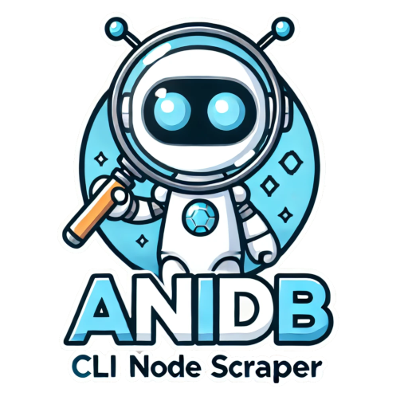
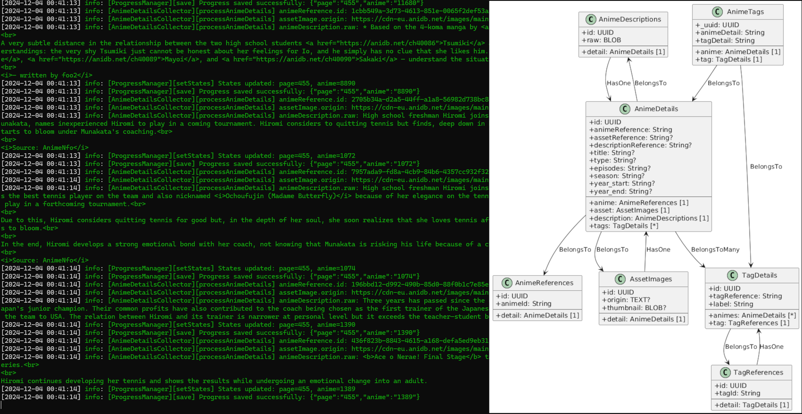

# **CLI Node Scraper for AniDB**

<p align="center">
  
</p>


> **Version**: `1.0.1`

A powerful CLI scraper for AniDB, built with Node.js and TypeScript, designed to extract references and detailed information about anime. This project is designed to be scalable, configurable, and easy to integrate.

 <!-- Placeholder: Replace with actual image -->

## **Features**

✅ Scraping data from AniDB, including:
  - Anime details
  - Anime references
  - Assets (images, tags, etc.)  
✅ Support for decorators and data validation.  
✅ Structured logging with Winston.  
✅ Environment configuration via `.env` file.  
✅ SQLite database with Sequelize and TypeScript.  
✅ Development tools like ESLint, Typedoc, and TypeScript.

## **Installation**

### Prerequisites

Make sure you have the following installed:
- **Node.js**: `>= 20.18.0`
- **Yarn**: `>= 1.x`

### Installation with Yarn

1. **Clone the repository**:
   ```bash
   git clone https://github.com/5h1ngy/cli-node-scraper-anidb.git
   cd cli-node-scraper-anidb
   ```

2. **Install dependencies**:
   ```bash
   yarn install
   ```

3. **Configure environment variables**:
   Create a `.env` file in the root directory:
   ```env
   NODE_ENV=development
   STORAGE_FILE=db_dump.db
   PROGRESS_FILE=progress.json
   LOGGING_DB=true
   LOG_DEFAULT_LEVEL=info
   ```

### Installation with npm for Global Use

You can install the scraper globally using `npm`:

1. **Install globally**:
   ```bash
   npm install -g .
   ```

2. **Run the scraper**:
   ```bash
   anime-scraper
   ```

## **Usage**

### Development Mode
Run the scraper in development mode:
```bash
yarn dev
```

### Production Mode
Build and run the scraper in production mode:
```bash
yarn build
yarn start
```

### Global CLI Command
After global installation, you can use the `anime-scraper` command:
```bash
anime-scraper
```

By default, the scraper will:
- Connect to the AniDB database.
- Retrieve anime references and details.
- Save the data in a local SQLite database.

You can customize the behavior using `.env` configuration.

## **Project Structure**

```
src/
├── config/         # Database configuration and environment variables
├── handlers/       # Error handling and helper utilities
├── models/         # Sequelize models for database entities
├── operations/     # Scraping and data collection operations
├── services/       # Services for downloading and parsing data
├── utils/          # Utility functions for formatting, extraction, and validation
├── index.ts        # Main entry point
```

## **Logging**

Logging is managed via [Winston](https://github.com/winstonjs/winston), with support for daily file rotation. Logs are saved in the `logs/` directory.

### Log Example:
```
[2024-11-19 12:34:56] info: Scraper starting...
[2024-11-19 12:34:57] verbose: Database connection established.
[2024-11-19 12:35:00] info: Processing anime ID 12345.
```

## **Documentation**

Documentation is automatically generated using **Typedoc**. You can generate it by running:

```bash
yarn build
```

The documentation will be generated in the `docs/` directory.

## **Database**

The project uses **SQLite** via Sequelize for data management.

- **Database Path**: Configurable via the `STORAGE_FILE` environment variable.
- **Synchronization**: Automatically synchronized at startup.

## **Requirements**

- **Node.js**: `>= 20.18.0`
- **Yarn**: `>= 4.5.1`
- **SQLite**: Installed on your system.

## **License and Data Attribution**

### License for the Code
This project is licensed under the MIT License. See the [LICENSE](LICENSE) file for full details.

### Data Attribution for AniDB
This project uses data from AniDB (https://anidb.net), which is licensed under the **Creative Commons Attribution-NonCommercial-ShareAlike 4.0 International License**.

#### Key Points:
- You **may not** use the data for **commercial purposes**.
- Any derivative works created using AniDB data **must** also be distributed under the same license.

For full details, visit the official license page: [https://creativecommons.org/licenses/by-nc-sa/4.0/](https://creativecommons.org/licenses/by-nc-sa/4.0/).

AniDB is the original source of the data. For more information about AniDB, visit [https://anidb.net](https://anidb.net).

## **Author**

Project created by 5h1ngy.

## **License**

This project is distributed under the MIT license. See the [LICENSE](LICENSE) file for more details.